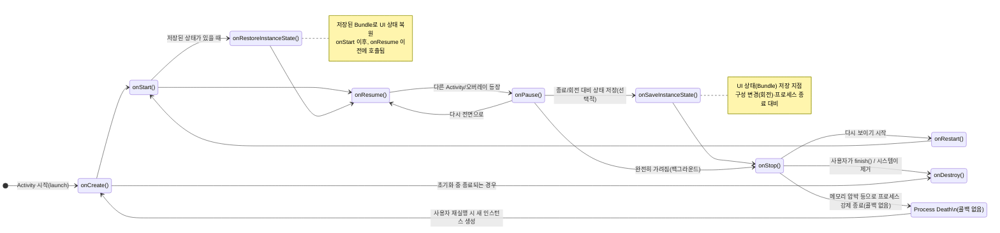

# 안드로이드 4대 구성요소

안드로이드는 4대 기본 구성요소로 이루어져 있음. Activity, Service, BroadCast Receiver, Content Provider가 그것임. 

- Activity : 사용자에게 인터페이스 제공
- Service : 백그라운드 조작 수행
- BroadCast Receiver : 외부 이벤트 수신
- Content Provider : 데이터 관리, 외부 데이터 사용

## Activity
 
액티비티는 화면의 기본 구성 단위임. 화면의 기본 UI를 출력하고 터치, 드래그, 키보드 입력과 같은 인터랙션을 제공함. 액티비티를 작동시키기 위해서 알아야 하는 생명 주기와 화면 전환 방법을 소개함.

1. Activity 작동시키기
   - XML 파일이나 미리보기 화면에서 구성하면 됨. 

2. Activity의 생명 주기
   - 사람도 유아기, 청소년기, 노년기를 거치고 각 시기에 맞는 행동을 하듯, 액티비티도 각 상태마다 할 수 있는 행동과 해야 할 행동이 다름.
   - 사람은 시간에 따라 자연스럽게 커가지만, 액티비티는 사용자의 행동에 따라 새로운 상태를 갖게 됨. 그리고 그 상태에 들어가면 미리 정의된 콜백 함수를 실행함.

앱은 생성된 상태, 시작된 상태, 재개된 상태, 일시정지된 상태, 멈춰진 상태, 종료된 상태가 있음. 